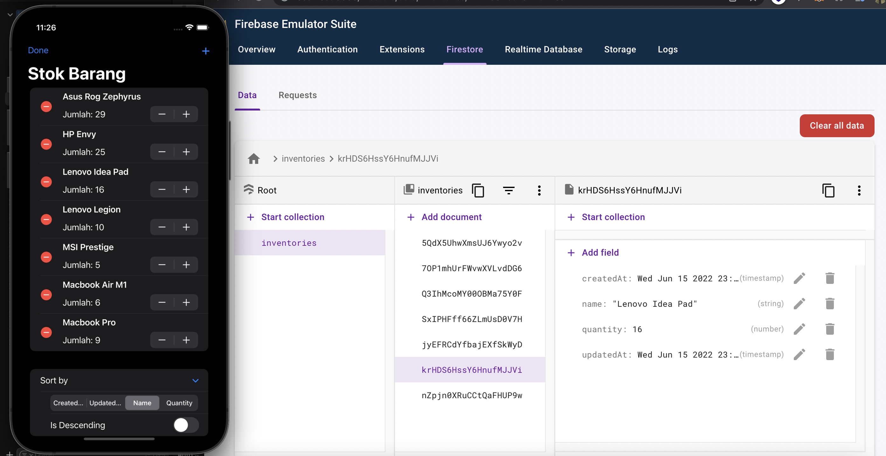

# iStockery

<!-- ABOUT THE PROJECT -->
<p align="center">
  <a href="#" target="_blank"></a>
</p>

Aplikasi iStockery adalah aplikasi stok inventory berbasis iOS yang dibuat menggunakan Firebase (Firestore) secara Local dengan fitur CRUD dan Sorting.

## Preview
<p align="center">
    <a href="#" target="_blank"></a>
</p>

<!-- ABOUT THE FILE & FOLDER STRUCTURE -->
## Folder & File Structure
Berikut struktur file dan folder pada iStockery:

    .
    ├── iStockeryApp.swift          # Root Project: Konfirgurasi Firebase Firestore
    ├── StockItem.swift             # Deklarasi Attribute dari Firestore Collection & Dari Aplikasi
    ├── ContentView.swift           # Tampilan Beranda Aplikasi
    ├── SortType.swift              # Berisikan Data Attribute dari Collection Firestore yang digunakan
    ├── info
    └── StockListViewModel.swift    # Berisikan Fungsi CRUD

### Build With:

* [Swift](https://www.swift.org/documentation/)
* [SwiftUI](https://developer.apple.com/documentation/swiftui/)
* [Xcode](https://developer.apple.com/xcode/)
* [Firebase / Firestore](https://firebase.google.com/)

### Requirements (How to Configure)
* [Java 11](https://chamikakasun.medium.com/how-to-manage-multiple-java-version-in-macos-e5421345f6d0)
* [Node 8](https://formulae.brew.sh/formula/node#default)
* [Firebase CLI](https://firebase.google.com/docs/cli?authuser=0#mac-linux-npm)

<!-- How to Install -->
## Installation
Untuk menggunakan repositori ini, ikutilah petunjuk penggunaan berikut dan pastikan git sudah terinstall pada komputer (semua perintah dilaksanakan pada `cmd.exe` atau `terminal`):

1. Lakukan download .zip atau `clone` repositori dengan cara:
```bash
git clone https://github.com/dekapd99/iStockery.git
```

2. Jika mendownload .zip, Extract zip tersebut dan buka Project di Xcode.
3. Klik iStockery (paling atas) di Project Navigator. Cari TARGETS di panel iStockery dan klik Info.
4. Buka website Firebase dan lakukan Login, kemudian klik Go To Console dan Add Projects. Pastikan namanya adalah "iStockery" dan matikan Google Analytic karena tidak diperlukan.
5. Klik icon iOS Apple pada halaman project iStockery. Dan pastikan untuk masukkan nama pada Bundle ID contohnya seperti ini ".com.deka.iStockery".
6. Setelah itu, Download Config File yang diberikan oleh Firebase dan klik Next. Setelah itu, Copy Dependencies / Package URL yang diberikan.
7. Buka Xcode, klik General ubah dan sesuaikan nama Bundle Identifier seperti di Project Firebase.
8. Klik File > Add Packages. Paste URL Dependencies / Package pada kolom Search. Ubah Depedency Rule menjadi Branch - master dan klik Add Package.
9. Drag & Drop Config File (GoogleService-Info.plist) yang diberikan oleh Firebase ke dalam Project Navigation. 
10. Ikuti installasi secara Manual melalui Website [Firebase](https://firebase.google.com/docs/cli?authuser=0#mac-linux-npm) atau Firebase CLI via [Homebrew](https://formulae.brew.sh/formula/firebase-cli).
11. Lakukan Login dengan Firebase, Inisialisasi Emulators (Pastikan menggunakan Firestore Emulators), Setting Ports, dan Cek Project List yang ada
```bash
firebase login
firebase init emulators
firebase projects:list
```

12. Gunakan Project iStockery dari List Project yang ada -> Copy dan Paste Projects ID ke dalam Perintah ini
```bash
firebase use *project id*

contoh: firebase use istockery-d47d0
```

13. Start Firebase di Local dengan command
```bash
firebase emulators:start
```

14. Buka halaman baru di Browser, Copy & Paste URL Localhost
15. Buat Scheme Database sederhana: Klik Start Collection, Collection ID = inventories.
16. Akan ada 4 fields, yaitu:
* Document ID: Biarkan Saja
* (name, String, "") -> valuenya boleh diisi boleh tidak
* (quantity, Number, "1") -> default valuenya dibuat jadi 1
* (createdAt, Timestamp, "") -> valuenya diamkan saja karena akan autofill
* (updatedAt, Timestamp, "") -> valuenya diamkan saja karena akan autofill
17. Build & Run

<!-- What Kind of License? -->
## License
No License 

<p align="right">(<a href="#top">back to top</a>)</p>
